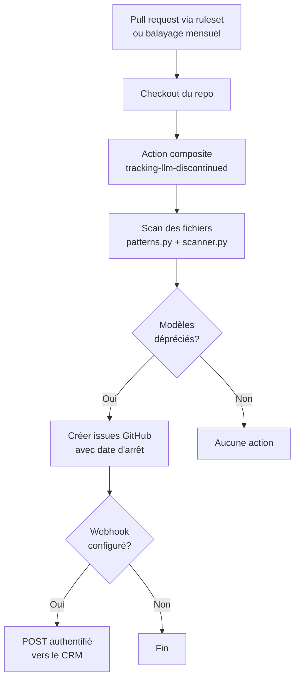
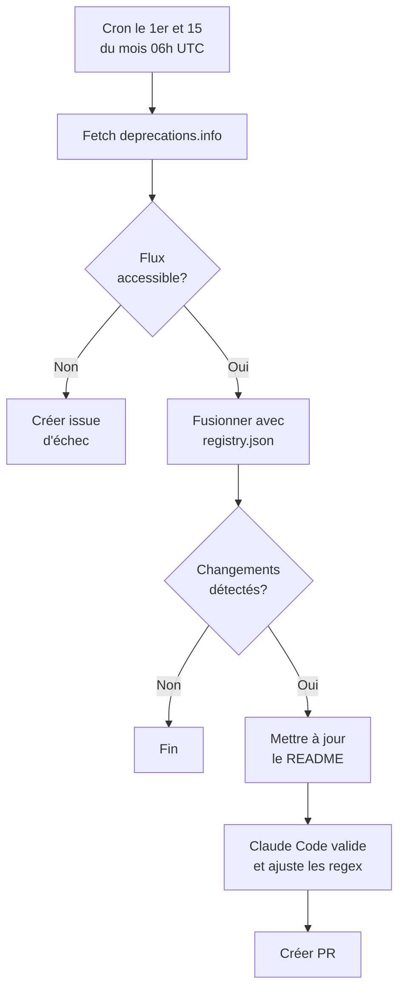

# LLM Configuration Scanner

Action composite GitHub qui scanne les dépôts pour détecter les références à des modèles LLM et crée des issues lorsque des modèles dépréciés sont détectés.

## Ce que ça fait

1. **Scanne** le code source et les fichiers de configuration pour trouver les références aux modèles LLM (OpenAI, Anthropic, Google) via **pattern matching regex**
2. **Vérifie** contre un registre de dépréciation JSON (`data/registry.json`) les modèles dépréciés/en retrait/arrêtés
3. **Crée des issues GitHub** pour chaque modèle déprécié trouvé, avec les fichiers affectés et les dates d'arrêt

L'action composite exécutée dans vos repos ne fait aucun appel à une API AI/LLM — c'est purement de l'analyse statique (regex + registre JSON). Claude est utilisé uniquement pour la maintenance de ce repo (développement des regex, mise à jour du registre de dépréciation).

### Workflow de scan (repos consommateurs)



## Modèles dépréciés suivis

<!-- REGISTRY_START -->
| Model | Provider | Status | Shutdown date |
|---|---|---|---|
| claude-1.0 | anthropic | shutdown | 2024-11-06 |
| claude-1.1 | anthropic | shutdown | 2024-11-06 |
| claude-1.2 | anthropic | shutdown | 2024-11-06 |
| claude-1.3 | anthropic | shutdown | 2024-11-06 |
| claude-2.0 | anthropic | shutdown | 2025-07-21 |
| claude-2.1 | anthropic | shutdown | 2025-07-21 |
| claude-3-5-haiku-20241022 | anthropic | shutdown | 2026-02-19 |
| claude-3-5-sonnet-20240620 | anthropic | shutdown | 2025-10-28 |
| claude-3-5-sonnet-20241022 | anthropic | shutdown | 2025-10-28 |
| claude-3-7-sonnet-20250219 | anthropic | shutdown | 2026-02-19 |
| claude-3-haiku-20240307 | anthropic | shutdown | 2026-04-20 |
| claude-3-opus | anthropic | shutdown | 2026-01-05 |
| claude-3-opus-20240229 | anthropic | shutdown | 2026-01-05 |
| claude-3-sonnet | anthropic | shutdown | 2025-07-21 |
| claude-3-sonnet-20240229 | anthropic | shutdown | 2025-07-21 |
| claude-3.5-haiku | anthropic | shutdown | 2026-02-19 |
| claude-3.5-sonnet | anthropic | shutdown | 2025-10-28 |
| claude-instant-1.0 | anthropic | shutdown | 2024-11-06 |
| claude-instant-1.1 | anthropic | shutdown | 2024-11-06 |
| claude-instant-1.2 | anthropic | shutdown | 2024-11-06 |
| claude-opus-4-1-20250805 | anthropic | shutdown | 2026-08-05 |
| claude-opus-4-20250514 | anthropic | shutdown | 2026-06-15 |
| claude-sonnet-4-20250514 | anthropic | shutdown | 2026-06-15 |
| embedding-001 | google | shutdown | 2025-10-30 |
| embedding-2-preview | google | shutdown | 2026-08-10 |
| embedding-gecko-001 | google | shutdown | 2025-10-30 |
| gemini-1.0-pro | google | shutdown | 2025-02-18 |
| gemini-1.0-pro-vision | google | shutdown | 2024-07-12 |
| gemini-1.5-flash | google | shutdown | 2025-09-29 |
| gemini-1.5-flash-8b | google | shutdown | 2025-09-29 |
| gemini-1.5-pro | google | shutdown | 2025-09-29 |
| gemini-2.0-flash | google | shutdown | 2026-06-01 |
| gemini-2.0-flash-001 | google | shutdown | 2026-06-01 |
| gemini-2.0-flash-exp | google | shutdown | 2025-12-09 |
| gemini-2.0-flash-exp-image-generation | google | shutdown | 2025-11-14 |
| gemini-2.0-flash-lite | google | shutdown | 2026-06-01 |
| gemini-2.0-flash-lite-001 | google | shutdown | 2026-06-01 |
| gemini-2.0-flash-lite-preview | google | shutdown | 2025-12-09 |
| gemini-2.0-flash-lite-preview-02-05 | google | shutdown | 2025-12-09 |
| gemini-2.0-flash-live-001 | google | shutdown | 2025-12-09 |
| gemini-2.0-flash-preview-image-generation | google | shutdown | 2025-11-14 |
| gemini-2.0-flash-thinking-exp | google | shutdown | 2025-12-02 |
| gemini-2.0-flash-thinking-exp-01-21 | google | shutdown | 2025-12-02 |
| gemini-2.0-flash-thinking-exp-1219 | google | shutdown | 2025-12-02 |
| gemini-2.0-pro-exp | google | shutdown | 2025-12-09 |
| gemini-2.0-pro-exp-02-05 | google | shutdown | 2025-12-09 |
| gemini-2.5-flash | google | deprecated |  |
| gemini-2.5-flash-exp-native-audio-thinking-dialog | google | shutdown | 2025-10-20 |
| gemini-2.5-flash-image | google | retiring | 2026-10-02 |
| gemini-2.5-flash-image-preview | google | shutdown | 2026-01-15 |
| gemini-2.5-flash-lite | google | retiring | 2026-10-16 |
| gemini-2.5-flash-lite-preview-06-17 | google | shutdown | 2025-11-18 |
| gemini-2.5-flash-lite-preview-09-2025 | google | shutdown | 2026-03-31 |
| gemini-2.5-flash-native-audio-preview-09-2025 | google | deprecated |  |
| gemini-2.5-flash-preview-04-17 | google | shutdown | 2025-07-15 |
| gemini-2.5-flash-preview-05-20 | google | shutdown | 2025-11-18 |
| gemini-2.5-flash-preview-09-25 | google | shutdown | 2026-02-17 |
| gemini-2.5-flash-preview-native-audio-dialog | google | shutdown | 2025-10-20 |
| gemini-2.5-pro | google | deprecated |  |
| gemini-2.5-pro-exp-03-25 | google | shutdown | 2025-06-26 |
| gemini-2.5-pro-preview-03-25 | google | shutdown | 2025-12-02 |
| gemini-2.5-pro-preview-05-06 | google | shutdown | 2025-12-02 |
| gemini-2.5-pro-preview-06-05 | google | shutdown | 2025-12-02 |
| gemini-3-pro-image-preview | google | shutdown | 2026-06-25 |
| gemini-3-pro-preview | google | shutdown | 2026-03-09 |
| gemini-3.1-flash-image-preview | google | shutdown | 2026-06-25 |
| gemini-3.1-flash-lite | google | retiring | 2027-05-07 |
| gemini-3.1-flash-lite-preview | google | shutdown | 2026-05-25 |
| gemini-embedding-001 | google | retiring | 2028-05-14 |
| gemini-embedding-2-preview | google | deprecated |  |
| gemini-embedding-exp | google | shutdown | 2025-10-30 |
| gemini-embedding-exp-03-07 | google | shutdown | 2025-10-30 |
| gemini-live-2.5-flash-preview | google | shutdown | 2025-12-09 |
| gemini-pro | google | shutdown | 2025-02-15 |
| gemini-robotics-er-1.5-preview | google | shutdown | 2026-04-30 |
| gemini-robotics-er-1.6-preview | google | retiring | 2026-08-31 |
| imagen-3.0-generate-002 | google | shutdown | 2025-11-10 |
| imagen-4.0-fast-generate-001 | google | retiring | 2026-08-17 |
| imagen-4.0-generate-001 | google | retiring | 2026-08-17 |
| imagen-4.0-generate-preview-06-06 | google | shutdown | 2026-02-17 |
| imagen-4.0-ultra-generate-001 | google | retiring | 2026-08-17 |
| imagen-4.0-ultra-generate-preview-06-06 | google | shutdown | 2026-02-17 |
| text-embedding-004 | google | shutdown | 2026-01-14 |
| veo-2.0-generate-001 | google | shutdown | 2026-06-30 |
| veo-3.0-fast-generate-001 | google | shutdown | 2026-06-30 |
| veo-3.0-fast-generate-preview | google | shutdown | 2025-11-12 |
| veo-3.0-generate-001 | google | shutdown | 2026-06-30 |
| veo-3.0-generate-preview | google | shutdown | 2025-11-12 |
| ada | openai | shutdown | 2024-01-04 |
| babbage | openai | shutdown | 2024-01-04 |
| babbage-002 | openai | retiring | 2026-09-28 |
| chatgpt-4o-latest | openai | shutdown | 2026-02-17 |
| chatgpt-image-latest | openai | retiring | 2026-12-01 |
| code-cushman-001 | openai | shutdown | 2023-03-23 |
| code-cushman-002 | openai | shutdown | 2023-03-23 |
| code-davinci-001 | openai | shutdown | 2023-03-23 |
| code-davinci-002 | openai | shutdown | 2024-01-04 |
| code-davinci-edit-001 | openai | shutdown | 2024-01-04 |
| code-search-ada-code-001 | openai | shutdown | 2024-01-04 |
| code-search-ada-text-001 | openai | shutdown | 2024-01-04 |
| code-search-babbage-code-001 | openai | shutdown | 2024-01-04 |
| code-search-babbage-text-001 | openai | shutdown | 2024-01-04 |
| codex-mini-latest | openai | shutdown | 2026-02-12 |
| computer-use-preview | openai | shutdown | 2026-07-23 |
| computer-use-preview-2025-03-11 | openai | shutdown | 2026-07-23 |
| curie | openai | shutdown | 2024-01-04 |
| dall-e-2 | openai | shutdown | 2026-05-12 |
| dall-e-3 | openai | shutdown | 2026-05-12 |
| davinci | openai | shutdown | 2024-01-04 |
| davinci-002 | openai | retiring | 2026-09-28 |
| ft-babbage-002 | openai | retiring | 2026-10-23 |
| ft-davinci-002 | openai | retiring | 2026-10-23 |
| ft-gpt-3.5-turbo | openai | retiring | 2026-10-23 |
| ft-gpt-4 | openai | retiring | 2026-10-23 |
| ft-gpt-4.1-nano-2025-04-14 | openai | retiring | 2026-10-23 |
| ft-o4-mini-2025-04-16 | openai | retiring | 2026-10-23 |
| gpt-3.5-turbo | openai | retiring | 2026-10-23 |
| gpt-3.5-turbo-0125 | openai | retiring | 2026-10-23 |
| gpt-3.5-turbo-0301 | openai | shutdown | 2024-09-13 |
| gpt-3.5-turbo-0613 | openai | shutdown | 2024-09-13 |
| gpt-3.5-turbo-1106 | openai | retiring | 2026-09-28 |
| gpt-3.5-turbo-16k-0613 | openai | shutdown | 2024-09-13 |
| gpt-3.5-turbo-completions | openai | retiring | 2026-10-23 |
| gpt-3.5-turbo-instruct | openai | retiring | 2026-09-28 |
| gpt-4 | openai | retiring | 2026-10-23 |
| gpt-4-0125-preview | openai | shutdown | 2026-03-26 |
| gpt-4-0314 | openai | shutdown | 2026-03-26 |
| gpt-4-0613 | openai | retiring | 2026-10-23 |
| gpt-4-0613-completions | openai | retiring | 2026-10-23 |
| gpt-4-1106-preview | openai | retiring | 2026-10-23 |
| gpt-4-1106-vision-preview | openai | shutdown | 2024-12-06 |
| gpt-4-32k | openai | shutdown | 2025-06-06 |
| gpt-4-32k-0314 | openai | shutdown | 2025-06-06 |
| gpt-4-32k-0613 | openai | shutdown | 2025-06-06 |
| gpt-4-completions | openai | retiring | 2026-10-23 |
| gpt-4-turbo | openai | retiring | 2026-10-23 |
| gpt-4-turbo-2024-04-09 | openai | retiring | 2026-10-23 |
| gpt-4-turbo-completions | openai | retiring | 2026-10-23 |
| gpt-4-turbo-preview | openai | shutdown | 2026-03-26 |
| gpt-4-turbo-preview-completions | openai | shutdown | 2026-03-26 |
| gpt-4-vision-preview | openai | shutdown | 2024-12-06 |
| gpt-4.1-nano | openai | retiring | 2026-10-23 |
| gpt-4.1-nano-2025-04-14 | openai | retiring | 2026-10-23 |
| gpt-4.5-preview | openai | shutdown | 2025-07-14 |
| gpt-4o | openai | retiring | 2026-10-01 |
| gpt-4o-2024-05-13 | openai | retiring | 2026-10-23 |
| gpt-4o-audio | openai | retiring | 2027-01-20 |
| gpt-4o-audio-preview | openai | shutdown | 2026-05-07 |
| gpt-4o-audio-preview-2024-10-01 | openai | shutdown | 2025-10-10 |
| gpt-4o-audio-preview-2024-12-17 | openai | shutdown | 2026-07-23 |
| gpt-4o-mini | openai | retiring | 2026-10-01 |
| gpt-4o-mini-audio | openai | retiring | 2027-01-20 |
| gpt-4o-mini-audio-preview | openai | shutdown | 2026-05-07 |
| gpt-4o-mini-audio-preview-2024-12-17 | openai | shutdown | 2026-07-23 |
| gpt-4o-mini-realtime | openai | retiring | 2027-01-20 |
| gpt-4o-mini-realtime-preview | openai | shutdown | 2026-05-07 |
| gpt-4o-mini-realtime-preview-2024-12-17 | openai | shutdown | 2026-07-23 |
| gpt-4o-mini-search-preview-2025-03-11 | openai | shutdown | 2026-07-23 |
| gpt-4o-mini-transcribe-2025-03-20 | openai | retiring | 2027-01-20 |
| gpt-4o-mini-tts-2025-03-20 | openai | shutdown | 2026-07-23 |
| gpt-4o-realtime | openai | retiring | 2027-01-20 |
| gpt-4o-realtime-preview | openai | shutdown | 2026-05-07 |
| gpt-4o-realtime-preview-2024-10-01 | openai | shutdown | 2025-10-10 |
| gpt-4o-realtime-preview-2024-12-17 | openai | shutdown | 2026-05-07 |
| gpt-4o-realtime-preview-2025-06-03 | openai | shutdown | 2026-05-07 |
| gpt-4o-search-preview-2025-03-11 | openai | shutdown | 2026-07-23 |
| gpt-5-2025-08-07 | openai | retiring | 2026-12-11 |
| gpt-5-chat-latest | openai | shutdown | 2026-07-23 |
| gpt-5-codex | openai | shutdown | 2026-07-23 |
| gpt-5-mini-2025-08-07 | openai | retiring | 2026-12-11 |
| gpt-5-nano-2025-08-07 | openai | retiring | 2026-12-11 |
| gpt-5-pro-2025-10-06 | openai | retiring | 2026-12-11 |
| gpt-5.1-chat-latest | openai | shutdown | 2026-07-23 |
| gpt-5.1-codex | openai | shutdown | 2026-07-23 |
| gpt-5.1-codex-max | openai | shutdown | 2026-07-23 |
| gpt-5.1-codex-mini | openai | shutdown | 2026-07-23 |
| gpt-5.2-chat-latest | openai | shutdown | 2026-08-10 |
| gpt-5.2-codex | openai | shutdown | 2026-07-23 |
| gpt-5.3-chat-latest | openai | shutdown | 2026-08-10 |
| gpt-audio | openai | retiring | 2027-01-20 |
| gpt-audio-mini | openai | retiring | 2027-01-20 |
| gpt-audio-mini-2025-10-06 | openai | shutdown | 2026-07-23 |
| gpt-image-1 | openai | retiring | 2026-10-23 |
| gpt-image-1-mini | openai | retiring | 2026-12-01 |
| gpt-image-1.5 | openai | retiring | 2026-12-01 |
| gpt-realtime | openai | retiring | 2027-01-20 |
| gpt-realtime-mini | openai | retiring | 2027-01-20 |
| gpt-realtime-mini-2025-10-06 | openai | shutdown | 2026-07-23 |
| o1 | openai | retiring | 2026-10-23 |
| o1-2024-12-17 | openai | retiring | 2026-10-23 |
| o1-mini | openai | shutdown | 2025-10-27 |
| o1-preview | openai | shutdown | 2025-07-28 |
| o1-pro | openai | retiring | 2026-10-23 |
| o1-pro-2025-03-19 | openai | retiring | 2026-10-23 |
| o3-2025-04-16 | openai | retiring | 2026-12-11 |
| o3-deep-research | openai | shutdown | 2026-07-23 |
| o3-deep-research-2025-06-26 | openai | shutdown | 2026-07-23 |
| o3-mini | openai | retiring | 2026-10-23 |
| o3-mini-2025-01-31 | openai | retiring | 2026-10-23 |
| o3-pro-2025-06-10 | openai | retiring | 2026-12-11 |
| o4-mini | openai | retiring | 2026-10-23 |
| o4-mini-2025-04-16 | openai | retiring | 2026-10-23 |
| o4-mini-deep-research | openai | shutdown | 2026-07-23 |
| o4-mini-deep-research-2025-06-26 | openai | shutdown | 2026-07-23 |
| sora-2 | openai | retiring | 2026-09-24 |
| sora-2-2025-10-06 | openai | retiring | 2026-09-24 |
| sora-2-2025-12-08 | openai | retiring | 2026-09-24 |
| sora-2-pro | openai | retiring | 2026-09-24 |
| sora-2-pro-2025-10-06 | openai | retiring | 2026-09-24 |
| text-ada-001 | openai | shutdown | 2024-01-04 |
| text-babbage-001 | openai | shutdown | 2024-01-04 |
| text-curie-001 | openai | shutdown | 2024-01-04 |
| text-davinci-001 | openai | shutdown | 2024-01-04 |
| text-davinci-002 | openai | shutdown | 2024-01-04 |
| text-davinci-003 | openai | shutdown | 2024-01-04 |
| text-davinci-edit-001 | openai | shutdown | 2024-01-04 |
| text-embedding-ada-002 | openai | retiring | 2027-04-15 |
| text-moderation | openai | shutdown | 2025-04-28 |
| text-moderation-007 | openai | shutdown | 2025-10-27 |
| text-moderation-latest | openai | shutdown | 2025-10-27 |
| text-moderation-stable | openai | shutdown | 2025-10-27 |
| text-search-ada-doc-001 | openai | shutdown | 2024-01-04 |
| text-search-ada-query-001 | openai | shutdown | 2024-01-04 |
| text-search-babbage-doc-001 | openai | shutdown | 2024-01-04 |
| text-search-babbage-query-001 | openai | shutdown | 2024-01-04 |
| text-search-curie-doc-001 | openai | shutdown | 2024-01-04 |
| text-search-curie-query-001 | openai | shutdown | 2024-01-04 |
| text-search-davinci-doc-001 | openai | shutdown | 2024-01-04 |
| text-search-davinci-query-001 | openai | shutdown | 2024-01-04 |
| text-similarity-ada-001 | openai | shutdown | 2024-01-04 |
| text-similarity-babbage-001 | openai | shutdown | 2024-01-04 |
| text-similarity-curie-001 | openai | shutdown | 2024-01-04 |
| text-similarity-davinci-001 | openai | shutdown | 2024-01-04 |
<!-- REGISTRY_END -->

---

## Deux mécanismes complémentaires

Le scan couvre deux risques différents, et un seul mécanisme ne peut pas couvrir les deux.

| Risque | Mécanisme | Déclencheur |
|---|---|---|
| Un modèle déprécié est **introduit** dans le code | Ruleset organisationnel appelant `Baseline-quebec/.github` | Pull request, merge queue |
| Un modèle **devient** déprécié alors que le code n'a pas bougé | `org-sweep.yml` de ce dépôt | Cron mensuel |

La distinction est la raison d'être du balayage. Quand un fournisseur déprécie un modèle, le registre change mais votre code ne change pas : aucune pull request n'est ouverte, donc aucune règle de ruleset ne se déclenche. C'est pourtant le scénario le plus fréquent, et celui qui vous laisse en production sur un modèle qui va s'arrêter.

### Balayage mensuel de l'organisation

`org-sweep.yml` tourne le 1er de chaque mois, une heure après la mise à jour du registre. Il liste les dépôts de l'organisation, les clone en surface dans un répertoire temporaire, les scanne contre le registre courant, ouvre une issue dans **le dépôt concerné**, et poste un rapport consolidé dans Slack.

Un seul message Slack pour tout le balayage, pas un par dépôt : quarante notifications le même matin sont indiscernables du bruit, et la première chose qu'on fait avec du bruit est de le couper. Le message part même quand rien n'est trouvé, parce qu'un canal silencieux est ambigu : on ne sait pas si le balayage a tourné ou s'il est cassé.

**Prérequis :** une GitHub App installée sur l'organisation, dont l'identifiant et la clé privée sont les secrets `ORG_SWEEP_APP_ID` et `ORG_SWEEP_APP_KEY`. Permissions requises, côté dépôt uniquement :

| Permission | Niveau | Pourquoi |
|---|---|---|
| Contents | Lecture | Cloner chaque dépôt pour le scanner |
| Issues | Lecture et écriture | Ouvrir l'alerte, et vérifier qu'elle n'existe pas déjà |
| Metadata | Lecture | Accordée automatiquement, non désactivable |

Une App plutôt qu'un jeton personnel : le balayage ne dépend d'aucune personne, ne casse pas quand quelqu'un quitte l'équipe, et n'a pas d'expiration à renouveler chaque année.

La liste des dépôts vient de `/installation/repositories` et non de `gh repo list` : un jeton d'installation ne peut pas énumérer une organisation via GraphQL. L'endpoint retourne exactement ce que l'App a le droit de toucher, ce qui est aussi la définition honnête du périmètre du balayage. Si la liste revient vide, le code fait échouer la run plutôt que de se terminer en vert sans avoir rien scanné.

**Slack, optionnel :** le formatage du rapport vit dans `baseline-automation`, la où se trouvent déjà le jeton Slack et les conventions de rapport de l'équipe. Ce dépôt ne fait qu'envoyer le résultat structuré au script Windmill qui le poste. Sans la variable `WINDMILL_RAPPORT_CONFORMITE_URL` et le secret `WINDMILL_TOKEN`, le balayage tourne et ouvre quand même les issues GitHub ; seul le message est sauté.

```bash
# Essai à blanc, sans créer d'issue ni de ticket
gh workflow run org-sweep.yml -f dry-run=true
```

---

## Utiliser l'action dans votre dépôt

> **Note :** depuis la mise en place du ruleset organisationnel, il n'y a plus rien à copier dans les dépôts de `Baseline-quebec`. Le workflow central est imposé automatiquement. Cette section reste valable pour un dépôt hors organisation.

### Ajouter le workflow

Copiez `template-workflow.yml` dans `.github/workflows/llm-scan.yml` de votre dépôt :

```yaml
name: LLM Configuration Scan

on:
  push:
    tags:
      - "*"
  schedule:
    - cron: "0 8 1,15 * *"  # 1er et 15 de chaque mois
  workflow_dispatch:

jobs:
  scan:
    runs-on: ubuntu-latest
    permissions:
      issues: write
      contents: read
    steps:
      - uses: actions/checkout@v4
      - uses: Baseline-quebec/tracking-llm-discontinued@main
        with:
          repo-name: ${{ github.repository }}
          assignees: ${{ vars.LLM_SCAN_ASSIGNEES || '' }}
          webhook-url: ${{ vars.LLM_SCAN_WEBHOOK_URL }}
          webhook-token: ${{ secrets.LLM_SCAN_WEBHOOK_TOKEN }}
```

Aucun secret ni variable n'est requis pour les repos consommateurs. L'action utilise le `GITHUB_TOKEN` automatique pour créer les issues. `LLM_SCAN_ASSIGNEES`, `LLM_SCAN_WEBHOOK_URL` et `LLM_SCAN_WEBHOOK_TOKEN` sont configurés au niveau de l'organisation.

### L'URL du webhook est une variable, pas un secret

Une destination n'est pas un identifiant. La mettre en secret la rend illisible
pour tout le monde, y compris pour les propriétaires de l'organisation, et c'est
exactement ce qui a permis à l'intégration CRM d'échouer en silence : le webhook
partait à chaque issue et recevait un **403** que personne ne pouvait
diagnostiquer, faute de pouvoir lire vers quoi il pointait.

L'URL vit donc dans une variable d'organisation, lisible et auditable. Seul le
jeton reste un secret. Si le récepteur répond 403 alors qu'aucun jeton n'est
configuré, le journal le dit explicitement au lieu de laisser un code d'erreur nu.

### Prérequis pour les forks

Les issues sont désactivées par défaut sur les forks GitHub. L'action échouera si elle détecte des modèles dépréciés mais ne peut pas créer d'issues. Activez les issues dans **Settings > General > Features > Issues** du repo.

### Ce que le scanner ignore de lui-même

Quatre catégories n'ont pas à être déclarées : elles ne sont jamais de la
configuration, quel que soit le dépôt.

**Les journaux de changements** (`CHANGELOG`, `CHANGES`, `HISTORY`, `NEWS`,
`RELEASES`, `RELEASE-NOTES`, quelle que soit l'extension). Une entrée comme
« update response llm to gpt-5-chat-latest » date une bascule ; le passage
suivant ajoutera une ligne, et les deux resteront vraies. Une entrée de journal
ne se réécrit pas : corrigée après coup, elle ne sert plus à reconstituer
l'historique. La signaler revenait à demander une correction qu'il ne faut pas
faire. Six dépôts de l'organisation avaient ouvert une issue sur leur seul
CHANGELOG.

**Les lignes entièrement commentées**, dans les langages qui ont des
commentaires (`.py`, `.js`, `.ts`, `.yaml`, `.toml`, `.tf`, `.cfg`…). Une
déclaration mise en commentaire est du code désactivé. Un commentaire de fin de
ligne ne compte pas : dans `model = "gpt-4o"  # à bumper`, la configuration est
bien active. `.md` et `.txt` sont volontairement exclus de cette règle, car `#`
y ouvre un titre et non un commentaire.

Cette seconde règle corrige le plus trompeur des faux positifs : un bloc commenté
contenant `claude-3-sonnet-20240229` avait produit l'issue la plus alarmante de
l'organisation, sur un modèle arrêté depuis treize mois que plus rien n'appelait.

**La prose des fichiers Markdown.** Markdown marque lui-même ce qui est du
code : les clôtures ```` ``` ```` ou `~~~`, et les backticks au fil du texte.
Hors de ces marques, un nom de modèle est cité dans une phrase, il n'y est pas
déclaré. Une configuration réellement documentée reste vue, parce qu'on l'écrit
en code — `MODEL="gpt-4o"` au fil d'une phrase, ou un bloc d'exemple.

Au fil du texte, les backticks à eux seuls ne suffisent pas : ils disent « ceci
est un terme technique », pas « ceci s'exécute ». On y met un chemin, une
commande, un nom de fonction — et un nom de modèle. Un span qui ne porte que le
nom du modèle le cite donc, exactement comme la phrase autour de lui. Une
déclaration porte autre chose que le nom : une affectation
(`` `MODEL="gpt-4o"` ``), une paire clé/valeur (`` `model: gpt-4o` ``), un
drapeau (`` `--model gpt-4o` ``), un appel (`` `ChatOpenAI(model="gpt-4o")` ``).
Ce sont les blancs, le signe égal et les guillemets qui trahissent cette forme.
À l'intérieur d'un bloc clôturé la question ne se pose pas : l'auteur y a
délimité du code, pas un mot.

L'issue #40 de `gabarits-slides` portait sur `gpt-4o-mini` dans une planche
décrivant l'architecture d'un système audité chez un client — « Un
**superviseur** (`` `gpt-4o-mini` ``) route vers **6 spécialistes** ». Rien n'y
est configuré, et la migration ne se ferait pas là. Sur ce dépôt, la règle passe
de trois signalements à un : le seul restant est un `model="…"` dans un extrait
Python.

L'issue #77 d'`agents-support` listait trois fichiers pour `gpt-4o` : un seul le
configurait. Les deux autres en parlaient — une fiche client résumant les
technologies d'un mandat livré en 2024, une étude de cas racontant une bascule.
Ni l'une ni l'autre ne se migre : corriger ce texte réécrirait un compte rendu.
Sur l'ensemble du dépôt, la règle retire dix signalements de ce type et garde
les trois vraies configurations.

`.txt` reste hors de cette règle, faute d'une convention qui y sépare le code de
la prose ; un fichier de notes se déclare dans `.llm-scan-ignore`. Un tableau
Markdown est de la prose lui aussi, backticks ou non : ni `| Modèle | gpt-4o |`
ni `` | Modèle | `gpt-4o` | `` ne sont signalés, alors que
`` | Défaut | `MODEL=gpt-4o` | `` l'est.

**Les fichiers et dossiers de test.** Un modèle fixé dans une fixture sert à
faire passer un test ; il n'est appelé par aucun service, et le migrer ne change
rien à ce qui répond en production. Un test qui épingle vraiment un modèle
arrêté se signale d'ailleurs tout seul : la suite passe au rouge, ce qui est un
signal plus sûr qu'une issue ouverte à côté.

Sont écartés les dossiers `tests/`, `test/`, `__tests__/`, `__mocks__/` et
`testdata/` — qui ne sont pas parcourus du tout — et, ailleurs, les fichiers
dont le nom suit une convention de test : `conftest.py`, `test_extraction.py`,
`pricing_test.py`, `VariantsPanel.test.tsx`, `agent.spec.ts`, `handler_test.go`.
Le nom seul ne suffit pas : `latest_model.py`, `contest.py` et `testing_utils.py`
restent du code qui tourne.

Trois dépôts avaient une issue ouverte sur leur seul `tests/conftest.py` :
`cmac-monorepo`, `metal-marquis-monorepo` et `tourisme-monteregie-chatbot`.

### Exclure des fichiers qui ne sont pas de la configuration

Le scanner compare des chaînes de caractères ; il ne sait pas distinguer
`model = "o4-mini"` d'une phrase de prose qui cite `o4-mini`. Un dépôt qui
contient de la donnée, des fixtures ou de la veille technologique déclenchera
donc des faux positifs qui reviennent à chaque passage.

Le dépôt scanné déclare lui-même ce qui n'est pas de la configuration, dans un
fichier **`.llm-scan-ignore`**, à sa racine ou dans n'importe quel sous-dossier :

```gitignore
# Résumés d'articles de veille : citent des noms de modèles en prose,
# aucune configuration.
src/baseline_automation/windmill/f/bgy/ingestion/_articles_seed.py

# Jeux de données de test
tests/fixtures/
```

Règles de correspondance :

| Motif | Ce qu'il couvre |
|---|---|
| `seed.py` | ce nom de fichier **à n'importe quelle profondeur** |
| `fixtures/` | ce dossier et tout son contenu, qui n'est même pas parcouru |
| `src/data/seed.py` | ce chemin précis, relatif à la racine du dépôt |
| `*_seed.py` | tout fichier dont le nom finit ainsi |
| `docs/*.md` | les fichiers `.md` sous `docs/` |

Les lignes vides et celles commençant par `#` sont ignorées. Les chemins sont
comparés en séparateurs POSIX, donc un motif écrit une fois vaut sur les trois
systèmes.

Chaque chemin écarté est **nommé dans le journal du scan**, pas seulement
compté. Un motif trop large est ainsi visible dans les logs de l'exécution, au
lieu de produire un « 0 modèle déprécié » qui aurait l'air d'un scan complet.

Le fichier est lu depuis le dépôt analysé, y compris lors du balayage mensuel
de l'organisation : aucune configuration centrale à tenir à jour.

**Un fichier placé dans un sous-dossier ne vaut que pour ce sous-arbre**, et ses
motifs sont relatifs à ce dossier, comme un `.gitignore`. `Mandat/` écrit dans
`ODS/.llm-scan-ignore` désigne `ODS/Mandat`, pas le `Mandat/` de la racine. Un
fichier d'exclusion reste donc valide quand son dossier est déplacé — c'est
précisément ce qui avait manqué : le `.llm-scan-ignore` de `Ventes` excluait tout
le dépôt jusqu'à ce qu'une remontée de racine le range sous `ODS/`, et les cinq
issues de faux positifs sont revenues sur les mêmes offres de service.

Un dossier déjà écarté par la racine n'est pas ouvert du tout : le fichier
d'exclusion qu'il contiendrait n'a alors rien à ajouter.

En dernier recours, l'action accepte aussi un `exclude-paths`, qui s'ajoute au
fichier du dépôt :

```yaml
      - uses: Baseline-quebec/tracking-llm-discontinued@main
        with:
          repo-name: ${{ github.repository }}
          exclude-paths: "docs/veille/, *_seed.py"
```

Préférez le fichier. Une exclusion versionnée dans le dépôt qu'elle concerne se
relit avec lui ; une exclusion posée dans le workflow est invisible depuis le
code qu'elle fait taire.

---

## Développement et maintenance du repo

Cette section concerne les mainteneurs du repo `tracking-llm-discontinued`.

### Source de données

| Source | Description |
|---|---|
| `data/registry.json` | Registre JSON des modèles dépréciés, commité dans le dépôt |
| [deprecations.info](https://deprecations.info/) | Flux en direct fusionné dans le registre deux fois par mois (le 1er et le 15) via GitHub Actions |

Le pipeline de scan lit uniquement le fichier JSON local — aucun appel réseau lors du scan.

### Mise à jour du registre

Le registre est mis à jour automatiquement deux fois par mois (le 1er et le 15 à 06:00 UTC) par `.github/workflows/update-registry.yml`.



Le workflow :

1. Récupère le flux depuis [deprecations.info](https://deprecations.info/)
2. Fusionne avec le registre existant
3. Si des changements sont détectés : met à jour le README et pousse sur une branche
4. Claude Code valide et ajuste les patterns regex si nécessaire
5. Crée une PR pour révision

Si le flux est inaccessible, une issue GitHub est créée et assignée aux mainteneurs.

Mise à jour manuelle :

```bash
PYTHONPATH=. python -m src.update_registry
```

### Configuration du repo

| Nom | Type | Description |
|---|---|---|
| `ANTHROPIC_API_KEY` | Repository secret | Clé API Anthropic pour la validation Claude dans le workflow de mise à jour |
| `LLM_SCAN_ASSIGNEES` | Organization variable | Noms d'utilisateur GitHub assignés aux issues (partagée avec les repos consommateurs) |
| `LLM_SCAN_WEBHOOK_URL` | Organization **variable** (optionnel) | URL du récepteur, appelée une fois par issue réellement créée |
| `LLM_SCAN_WEBHOOK_TOKEN` | Organization secret (optionnel) | Jeton porteur envoyé en `Authorization: Bearer`. Sans lui, une destination protégée répond 403 |

### Utilisation locale

```bash
PYTHONPATH=. python -m src.main --repo-name "my-repo" --scan-path /path/to/repo --dry-run
```

Avec webhook :

```bash
PYTHONPATH=. python -m src.main --repo-name "my-repo" --scan-path /path/to/repo --webhook-url "https://example.com/webhook"
```

### Tests

```bash
pip install pytest pytest-bdd
python -m pytest tests/ -v --rootdir=.
```

### Architecture

Aucune dépendance externe — utilise uniquement la bibliothèque standard Python et le CLI `gh`.

```
data/
  registry.json          # Registre JSON des modeles deprecies
src/
  patterns.py            # Patterns regex pour la detection de modeles
  scanner.py             # Parcours de repertoire et scan de fichiers
  scan_ignore.py         # Exclusions declarees par le depot (.llm-scan-ignore)
  models.py              # Modeles de donnees (ScanMatch, ScanResult)
  deprecations.py        # Chargement du registre + gestion des suffixes de date
  deprecation_feed.py    # Flux live depuis deprecations.info
  update_registry.py     # Script : fetch -> merge -> save (+ issue en cas d'echec)
  validate_patterns.py   # Validation de couverture regex pour les modeles du registre
  issue_reporter.py      # Creation d'issues GitHub via gh CLI
  webhook.py             # Notifications webhook HTTP POST pour integration CRM
  main.py                # Point d'entree CLI et orchestration du scan
.github/workflows/
  ci.yml                 # CI : lint, tests, type checking
  update-registry.yml    # Cron bimensuel : mise a jour registre + validation Claude
```
