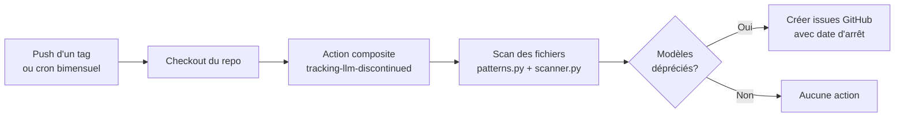
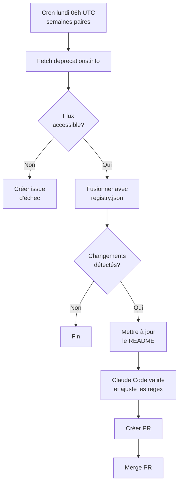

# LLM Configuration Scanner

Action composite GitHub qui scanne les dépôts pour détecter les références à des modèles LLM et crée des issues lorsque des modèles dépréciés sont détectés.

## Ce que ça fait

1. **Scanne** le code source et les fichiers de configuration pour trouver les références aux modèles LLM (OpenAI, Anthropic, Google)
2. **Vérifie** contre un registre de dépréciation JSON (`data/registry.json`) les modèles dépréciés/en retrait/arrêtés
3. **Crée des issues GitHub** pour chaque modèle déprécié trouvé, avec les fichiers affectés et les dates d'arrêt

### Workflow de scan (repos consommateurs)



## Modèles dépréciés suivis

<!-- REGISTRY_START -->
| Model | Provider | Status | Shutdown date |
|---|---|---|---|
| claude-3-opus | anthropic | shutdown | 2026-01-05 |
| claude-3-sonnet | anthropic | shutdown | 2025-07-21 |
| claude-3.5-haiku | anthropic | deprecated | 2026-02-19 |
| claude-3.5-sonnet | anthropic | shutdown | 2025-10-28 |
| gemini-1.5-flash | google | shutdown | 2025-09-23 |
| gemini-1.5-pro | google | shutdown | 2025-09-23 |
| gemini-2.0-flash | google | retiring | 2026-03-31 |
| gemini-pro | google | shutdown | 2025-02-15 |
| gpt-3.5-turbo | openai | deprecated | 2025-09-14 |
| gpt-4 | openai | retiring | 2026-06-06 |
| gpt-4-turbo | openai | retiring | 2026-06-06 |
| gpt-4-turbo-preview | openai | retiring | 2026-06-06 |
| gpt-4o | openai | retiring | 2026-10-01 |
| gpt-4o-mini | openai | retiring | 2026-10-01 |
| o1 | openai | retiring | 2026-07-15 |
| o1-mini | openai | shutdown | 2025-10-27 |
| o1-preview | openai | shutdown | 2025-07-28 |
| text-embedding-ada-002 | openai | retiring | 2027-04-15 |
<!-- REGISTRY_END -->

---

## Utiliser l'action dans votre dépôt

### 1. Ajouter le workflow

Copiez `template-workflow.yml` dans `.github/workflows/llm-scan.yml` de votre dépôt :

```yaml
name: LLM Configuration Scan

on:
  push:
    tags:
      - "v*"
  schedule:
    - cron: "0 8 1,15 * *"  # 1er et 15 de chaque mois
  workflow_dispatch:

jobs:
  scan:
    runs-on: ubuntu-latest
    permissions:
      issues: write
      contents: read
    steps:
      - uses: actions/checkout@v4
      - uses: Baseline-quebec/tracking-llm-discontinued@main
        with:
          repo-name: ${{ github.repository }}
          assignees: ${{ vars.LLM_SCAN_ASSIGNEES || '' }}
```

Aucun secret ni variable n'est requis pour les repos consommateurs. L'action utilise le `GITHUB_TOKEN` automatique pour créer les issues. La variable `LLM_SCAN_ASSIGNEES` est configurée au niveau de l'organisation.

---

## Développement et maintenance du repo

Cette section concerne les mainteneurs du repo `tracking-llm-discontinued`.

### Source de données

| Source | Description |
|---|---|
| `data/registry.json` | Registre JSON des modèles dépréciés, commité dans le dépôt |
| [deprecations.info](https://deprecations.info/) | Flux en direct fusionné dans le registre aux deux semaines via GitHub Actions |

Le pipeline de scan lit uniquement le fichier JSON local — aucun appel réseau lors du scan.

### Mise à jour du registre

Le registre est mis à jour automatiquement aux deux semaines (lundi à 06:00 UTC) par `.github/workflows/update-registry.yml`.



Le workflow :

1. Récupère le flux depuis [deprecations.info](https://deprecations.info/)
2. Fusionne avec le registre existant
3. Si des changements sont détectés : met à jour le README et pousse sur une branche
4. Claude Code valide et ajuste les patterns regex si nécessaire
5. Crée une PR et la merge automatiquement

Si le flux est inaccessible, une issue GitHub est créée et assignée aux mainteneurs.

Mise à jour manuelle :

```bash
PYTHONPATH=. python -m src.update_registry
```

### Configuration du repo

| Nom | Type | Description |
|---|---|---|
| `ANTHROPIC_API_KEY` | Repository secret | Clé API Anthropic pour la validation Claude dans le workflow de mise à jour |
| `LLM_SCAN_ASSIGNEES` | Organization variable | Noms d'utilisateur GitHub assignés aux issues (partagée avec les repos consommateurs) |

### Utilisation locale

```bash
PYTHONPATH=. python -m src.main --repo-name "my-repo" --scan-path /path/to/repo --dry-run
```

### Tests

```bash
pip install pytest pytest-bdd
python -m pytest tests/ -v --rootdir=.
```

### Architecture

```
data/
  registry.json          # Registre JSON des modeles deprecies
src/
  patterns.py            # Patterns regex pour la detection de modeles
  scanner.py             # Parcours de repertoire et scan de fichiers
  models.py              # Modeles de donnees (ScanMatch, ScanResult)
  deprecations.py        # Chargement du registre + gestion des suffixes de date
  deprecation_feed.py    # Flux live depuis deprecations.info
  update_registry.py     # Script : fetch -> merge -> save (+ issue en cas d'echec)
  validate_patterns.py   # Validation de couverture regex pour les modeles du registre
  issue_reporter.py      # Creation d'issues GitHub via gh CLI
  main.py                # Point d'entree CLI et orchestration du scan
.github/workflows/
  ci.yml                 # CI : lint, tests, type checking
  update-registry.yml    # Cron bimensuel : mise a jour registre + validation Claude
```
