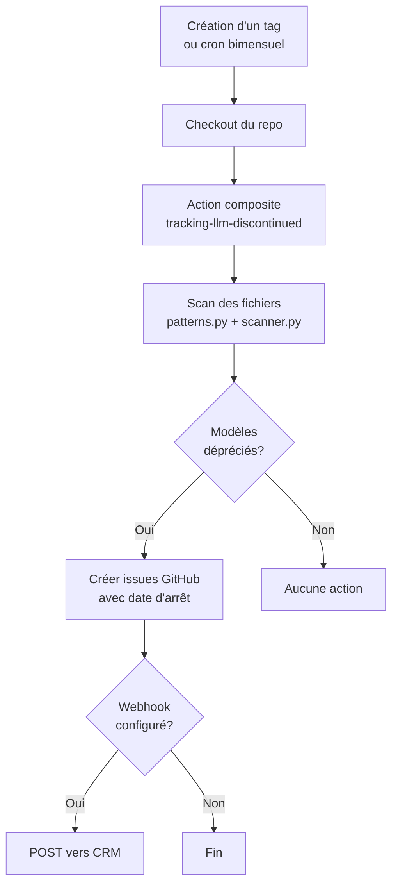
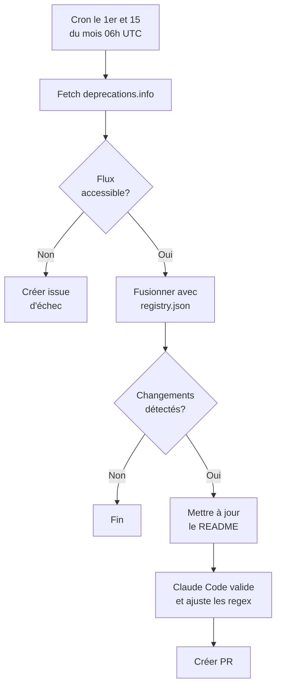

# LLM Configuration Scanner

Action composite GitHub qui scanne les dépôts pour détecter les références à des modèles LLM et crée des issues lorsque des modèles dépréciés sont détectés.

## Ce que ça fait

1. **Scanne** le code source et les fichiers de configuration pour trouver les références aux modèles LLM (OpenAI, Anthropic, Google) via **pattern matching regex**
2. **Vérifie** contre un registre de dépréciation JSON (`data/registry.json`) les modèles dépréciés/en retrait/arrêtés
3. **Crée des issues GitHub** pour chaque modèle déprécié trouvé, avec les fichiers affectés et les dates d'arrêt

L'action composite exécutée dans vos repos ne fait aucun appel à une API AI/LLM — c'est purement de l'analyse statique (regex + registre JSON). Claude est utilisé uniquement pour la maintenance de ce repo (développement des regex, mise à jour du registre de dépréciation).

### Workflow de scan (repos consommateurs)



## Modèles dépréciés suivis

<!-- REGISTRY_START -->
| Model | Provider | Status | Shutdown date |
|---|---|---|---|
| claude-1.0 | anthropic | shutdown | 2024-11-06 |
| claude-1.1 | anthropic | shutdown | 2024-11-06 |
| claude-1.2 | anthropic | shutdown | 2024-11-06 |
| claude-1.3 | anthropic | shutdown | 2024-11-06 |
| claude-2.0 | anthropic | shutdown | 2025-07-21 |
| claude-2.1 | anthropic | shutdown | 2025-07-21 |
| claude-3-5-haiku-20241022 | anthropic | shutdown | 2026-02-19 |
| claude-3-5-sonnet-20240620 | anthropic | shutdown | 2025-10-28 |
| claude-3-5-sonnet-20241022 | anthropic | shutdown | 2025-10-28 |
| claude-3-7-sonnet-20250219 | anthropic | shutdown | 2026-02-19 |
| claude-3-haiku-20240307 | anthropic | shutdown | 2026-04-20 |
| claude-3-opus | anthropic | shutdown | 2026-01-05 |
| claude-3-opus-20240229 | anthropic | shutdown | 2026-01-05 |
| claude-3-sonnet | anthropic | shutdown | 2025-07-21 |
| claude-3-sonnet-20240229 | anthropic | shutdown | 2025-07-21 |
| claude-3.5-haiku | anthropic | deprecated | 2026-02-19 |
| claude-3.5-sonnet | anthropic | shutdown | 2025-10-28 |
| claude-instant-1.0 | anthropic | shutdown | 2024-11-06 |
| claude-instant-1.1 | anthropic | shutdown | 2024-11-06 |
| claude-instant-1.2 | anthropic | shutdown | 2024-11-06 |
| claude-opus-4-20250514 | anthropic | retiring | 2026-06-15 |
| claude-sonnet-4-20250514 | anthropic | retiring | 2026-06-15 |
| gemini-1.0-pro | google | deprecated |  |
| gemini-1.0-pro-vision | google | deprecated |  |
| gemini-1.5-flash | google | deprecated |  |
| gemini-1.5-pro | google | shutdown | 2025-09-23 |
| gemini-2.0-flash | google | deprecated |  |
| gemini-2.0-flash-001 | google | deprecated |  |
| gemini-2.0-flash-exp | google | shutdown | 2025-12-09 |
| gemini-2.0-flash-exp-image-generation | google | deprecated |  |
| gemini-2.0-flash-lite | google | deprecated |  |
| gemini-2.0-flash-lite-001 | google | deprecated |  |
| gemini-2.0-flash-lite-preview | google | shutdown | 2025-12-09 |
| gemini-2.0-flash-lite-preview-02-05 | google | deprecated |  |
| gemini-2.0-flash-live-001 | google | deprecated |  |
| gemini-2.0-flash-preview-image-generation | google | deprecated |  |
| gemini-2.0-flash-thinking-exp | google | shutdown | 2025-12-02 |
| gemini-2.0-flash-thinking-exp-01-21 | google | deprecated |  |
| gemini-2.0-flash-thinking-exp-1219 | google | deprecated |  |
| gemini-2.0-pro-exp | google | shutdown | 2025-12-09 |
| gemini-2.0-pro-exp-02-05 | google | shutdown | 2025-12-09 |
| gemini-2.5-flash | google | deprecated |  |
| gemini-2.5-flash-exp-native-audio-thinking-dialog | google | deprecated |  |
| gemini-2.5-flash-image-preview | google | deprecated |  |
| gemini-2.5-flash-lite-preview-06-17 | google | deprecated |  |
| gemini-2.5-flash-lite-preview-09-2025 | google | deprecated |  |
| gemini-2.5-flash-native-audio-preview-09-2025 | google | deprecated |  |
| gemini-2.5-flash-preview-04-17 | google | deprecated |  |
| gemini-2.5-flash-preview-05-20 | google | deprecated |  |
| gemini-2.5-flash-preview-09-25 | google | deprecated |  |
| gemini-2.5-flash-preview-native-audio-dialog | google | deprecated |  |
| gemini-2.5-pro | google | deprecated |  |
| gemini-2.5-pro-preview-03-25 | google | shutdown | 2025-12-02 |
| gemini-2.5-pro-preview-05-06 | google | shutdown | 2025-12-02 |
| gemini-2.5-pro-preview-06-05 | google | shutdown | 2025-12-02 |
| gemini-3-pro-preview | google | deprecated |  |
| gemini-embedding-001 | google | deprecated |  |
| gemini-embedding-2-preview | google | deprecated |  |
| gemini-embedding-exp | google | deprecated |  |
| gemini-embedding-exp-03-07 | google | deprecated |  |
| gemini-live-2.5-flash-preview | google | deprecated |  |
| gemini-pro | google | shutdown | 2025-02-15 |
| gemini-robotics-er-1.5-preview | google | deprecated |  |
| gemini-robotics-er-1.6-preview | google | deprecated |  |
| imagen-3.0-generate-002 | google | deprecated |  |
| imagen-4.0-generate-preview-06-06 | google | deprecated |  |
| imagen-4.0-ultra-generate-preview-06-06 | google | deprecated |  |
| veo-3.0-fast-generate-preview | google | shutdown | 2025-11-12 |
| veo-3.0-generate-preview | google | shutdown | 2025-11-12 |
| ada | openai | shutdown | 2024-01-04 |
| babbage | openai | shutdown | 2024-01-04 |
| babbage-002 | openai | retiring | 2026-09-28 |
| chatgpt-4o-latest | openai | shutdown | 2026-02-17 |
| code-cushman-001 | openai | shutdown | 2023-03-23 |
| code-cushman-002 | openai | shutdown | 2023-03-23 |
| code-davinci-001 | openai | shutdown | 2023-03-23 |
| code-davinci-002 | openai | shutdown | 2024-01-04 |
| code-davinci-edit-001 | openai | shutdown | 2024-01-04 |
| code-search-ada-code-001 | openai | shutdown | 2024-01-04 |
| code-search-ada-text-001 | openai | shutdown | 2024-01-04 |
| code-search-babbage-code-001 | openai | shutdown | 2024-01-04 |
| code-search-babbage-text-001 | openai | shutdown | 2024-01-04 |
| codex-mini-latest | openai | shutdown | 2026-02-12 |
| computer-use-preview-2025-03-11 | openai | retiring | 2026-07-23 |
| curie | openai | shutdown | 2024-01-04 |
| dall-e-2 | openai | retiring | 2026-05-12 |
| dall-e-3 | openai | retiring | 2026-05-12 |
| davinci | openai | shutdown | 2024-01-04 |
| davinci-002 | openai | retiring | 2026-09-28 |
| ft-babbage-002 | openai | retiring | 2026-10-23 |
| ft-davinci-002 | openai | retiring | 2026-10-23 |
| ft-gpt-3.5-turbo | openai | retiring | 2026-10-23 |
| ft-gpt-4 | openai | retiring | 2026-10-23 |
| ft-gpt-4.1-nano-2025-04-14 | openai | retiring | 2026-10-23 |
| ft-o4-mini-2025-04-16 | openai | retiring | 2026-10-23 |
| gpt-3.5-turbo | openai | deprecated | 2025-09-14 |
| gpt-3.5-turbo-0125 | openai | retiring | 2026-10-23 |
| gpt-3.5-turbo-0301 | openai | shutdown | 2024-09-13 |
| gpt-3.5-turbo-0613 | openai | shutdown | 2024-09-13 |
| gpt-3.5-turbo-1106 | openai | retiring | 2026-09-28 |
| gpt-3.5-turbo-16k-0613 | openai | shutdown | 2024-09-13 |
| gpt-3.5-turbo-instruct | openai | retiring | 2026-09-28 |
| gpt-4 | openai | retiring | 2026-06-06 |
| gpt-4-0125-preview | openai | shutdown | 2026-03-26 |
| gpt-4-0314 | openai | shutdown | 2026-03-26 |
| gpt-4-0613 | openai | retiring | 2026-10-23 |
| gpt-4-1106-preview | openai | retiring | 2026-10-23 |
| gpt-4-1106-vision-preview | openai | shutdown | 2024-12-06 |
| gpt-4-32k | openai | shutdown | 2025-06-06 |
| gpt-4-32k-0314 | openai | shutdown | 2025-06-06 |
| gpt-4-32k-0613 | openai | shutdown | 2025-06-06 |
| gpt-4-turbo | openai | retiring | 2026-10-23 |
| gpt-4-turbo-preview | openai | shutdown | 2026-03-26 |
| gpt-4-turbo-preview-completions | openai | shutdown | 2026-03-26 |
| gpt-4-vision-preview | openai | shutdown | 2024-12-06 |
| gpt-4.1-nano | openai | retiring | 2026-10-23 |
| gpt-4.5-preview | openai | shutdown | 2025-07-14 |
| gpt-4o | openai | retiring | 2026-10-01 |
| gpt-4o-2024-05-13 | openai | retiring | 2026-10-23 |
| gpt-4o-audio-preview | openai | retiring | 2026-05-07 |
| gpt-4o-audio-preview-2024-10-01 | openai | shutdown | 2025-10-10 |
| gpt-4o-audio-preview-2024-12-17 | openai | retiring | 2026-07-23 |
| gpt-4o-mini | openai | retiring | 2026-10-01 |
| gpt-4o-mini-audio-preview | openai | retiring | 2026-05-07 |
| gpt-4o-mini-audio-preview-2024-12-17 | openai | retiring | 2026-07-23 |
| gpt-4o-mini-realtime-preview | openai | retiring | 2026-05-07 |
| gpt-4o-mini-realtime-preview-2024-12-17 | openai | retiring | 2026-07-23 |
| gpt-4o-mini-search-preview-2025-03-11 | openai | retiring | 2026-07-23 |
| gpt-4o-mini-tts-2025-03-20 | openai | retiring | 2026-07-23 |
| gpt-4o-realtime-preview | openai | retiring | 2026-05-07 |
| gpt-4o-realtime-preview-2024-10-01 | openai | shutdown | 2025-10-10 |
| gpt-4o-realtime-preview-2024-12-17 | openai | retiring | 2026-05-07 |
| gpt-4o-realtime-preview-2025-06-03 | openai | retiring | 2026-05-07 |
| gpt-4o-search-preview-2025-03-11 | openai | retiring | 2026-07-23 |
| gpt-5-chat-latest | openai | retiring | 2026-07-23 |
| gpt-5-codex | openai | retiring | 2026-07-23 |
| gpt-5.1-chat-latest | openai | retiring | 2026-07-23 |
| gpt-5.1-codex | openai | retiring | 2026-07-23 |
| gpt-5.1-codex-max | openai | retiring | 2026-07-23 |
| gpt-5.1-codex-mini | openai | retiring | 2026-07-23 |
| gpt-5.2-codex | openai | retiring | 2026-07-23 |
| gpt-audio-mini-2025-10-06 | openai | retiring | 2026-07-23 |
| gpt-image-1 | openai | retiring | 2026-10-23 |
| gpt-realtime-mini-2025-10-06 | openai | retiring | 2026-07-23 |
| o1 | openai | retiring | 2026-07-15 |
| o1-2024-12-17 | openai | retiring | 2026-10-23 |
| o1-mini | openai | shutdown | 2025-10-27 |
| o1-preview | openai | shutdown | 2025-07-28 |
| o1-pro-2025-03-19 | openai | retiring | 2026-10-23 |
| o3-deep-research-2025-06-26 | openai | retiring | 2026-07-23 |
| o3-mini-2025-01-31 | openai | retiring | 2026-10-23 |
| o4-mini-2025-04-16 | openai | retiring | 2026-10-23 |
| o4-mini-deep-research-2025-06-26 | openai | retiring | 2026-07-23 |
| sora-2 | openai | retiring | 2026-09-24 |
| sora-2-2025-10-06 | openai | retiring | 2026-09-24 |
| sora-2-2025-12-08 | openai | retiring | 2026-09-24 |
| sora-2-pro | openai | retiring | 2026-09-24 |
| sora-2-pro-2025-10-06 | openai | retiring | 2026-09-24 |
| text-ada-001 | openai | shutdown | 2024-01-04 |
| text-babbage-001 | openai | shutdown | 2024-01-04 |
| text-curie-001 | openai | shutdown | 2024-01-04 |
| text-davinci-001 | openai | shutdown | 2024-01-04 |
| text-davinci-002 | openai | shutdown | 2024-01-04 |
| text-davinci-003 | openai | shutdown | 2024-01-04 |
| text-davinci-edit-001 | openai | shutdown | 2024-01-04 |
| text-embedding-ada-002 | openai | retiring | 2027-04-15 |
| text-moderation | openai | shutdown | 2025-04-28 |
| text-moderation-007 | openai | shutdown | 2025-10-27 |
| text-moderation-latest | openai | shutdown | 2025-10-27 |
| text-moderation-stable | openai | shutdown | 2025-10-27 |
| text-search-ada-doc-001 | openai | shutdown | 2024-01-04 |
| text-search-ada-query-001 | openai | shutdown | 2024-01-04 |
| text-search-babbage-doc-001 | openai | shutdown | 2024-01-04 |
| text-search-babbage-query-001 | openai | shutdown | 2024-01-04 |
| text-search-curie-doc-001 | openai | shutdown | 2024-01-04 |
| text-search-curie-query-001 | openai | shutdown | 2024-01-04 |
| text-search-davinci-doc-001 | openai | shutdown | 2024-01-04 |
| text-search-davinci-query-001 | openai | shutdown | 2024-01-04 |
| text-similarity-ada-001 | openai | shutdown | 2024-01-04 |
| text-similarity-babbage-001 | openai | shutdown | 2024-01-04 |
| text-similarity-curie-001 | openai | shutdown | 2024-01-04 |
| text-similarity-davinci-001 | openai | shutdown | 2024-01-04 |
<!-- REGISTRY_END -->

---

## Utiliser l'action dans votre dépôt

### Ajouter le workflow

Copiez `template-workflow.yml` dans `.github/workflows/llm-scan.yml` de votre dépôt :

```yaml
name: LLM Configuration Scan

on:
  push:
    tags:
      - "*"
  schedule:
    - cron: "0 8 1,15 * *"  # 1er et 15 de chaque mois
  workflow_dispatch:

jobs:
  scan:
    runs-on: ubuntu-latest
    permissions:
      issues: write
      contents: read
    steps:
      - uses: actions/checkout@v4
      - uses: Baseline-quebec/tracking-llm-discontinued@main
        with:
          repo-name: ${{ github.repository }}
          assignees: ${{ vars.LLM_SCAN_ASSIGNEES || '' }}
          webhook-url: ${{ secrets.LLM_SCAN_WEBHOOK_URL }}
```

Aucun secret ni variable n'est requis pour les repos consommateurs. L'action utilise le `GITHUB_TOKEN` automatique pour créer les issues. La variable `LLM_SCAN_ASSIGNEES` et le secret `LLM_SCAN_WEBHOOK_URL` sont configurés au niveau de l'organisation.

### Prérequis pour les forks

Les issues sont désactivées par défaut sur les forks GitHub. L'action échouera si elle détecte des modèles dépréciés mais ne peut pas créer d'issues. Activez les issues dans **Settings > General > Features > Issues** du repo.

---

## Développement et maintenance du repo

Cette section concerne les mainteneurs du repo `tracking-llm-discontinued`.

### Source de données

| Source | Description |
|---|---|
| `data/registry.json` | Registre JSON des modèles dépréciés, commité dans le dépôt |
| [deprecations.info](https://deprecations.info/) | Flux en direct fusionné dans le registre deux fois par mois (le 1er et le 15) via GitHub Actions |

Le pipeline de scan lit uniquement le fichier JSON local — aucun appel réseau lors du scan.

### Mise à jour du registre

Le registre est mis à jour automatiquement deux fois par mois (le 1er et le 15 à 06:00 UTC) par `.github/workflows/update-registry.yml`.



Le workflow :

1. Récupère le flux depuis [deprecations.info](https://deprecations.info/)
2. Fusionne avec le registre existant
3. Si des changements sont détectés : met à jour le README et pousse sur une branche
4. Claude Code valide et ajuste les patterns regex si nécessaire
5. Crée une PR pour révision

Si le flux est inaccessible, une issue GitHub est créée et assignée aux mainteneurs.

Mise à jour manuelle :

```bash
PYTHONPATH=. python -m src.update_registry
```

### Configuration du repo

| Nom | Type | Description |
|---|---|---|
| `ANTHROPIC_API_KEY` | Repository secret | Clé API Anthropic pour la validation Claude dans le workflow de mise à jour |
| `LLM_SCAN_ASSIGNEES` | Organization variable | Noms d'utilisateur GitHub assignés aux issues (partagée avec les repos consommateurs) |
| `LLM_SCAN_WEBHOOK_URL` | Organization secret (optionnel) | URL webhook pour envoyer les détails des issues vers un CRM |

### Utilisation locale

```bash
PYTHONPATH=. python -m src.main --repo-name "my-repo" --scan-path /path/to/repo --dry-run
```

Avec webhook :

```bash
PYTHONPATH=. python -m src.main --repo-name "my-repo" --scan-path /path/to/repo --webhook-url "https://example.com/webhook"
```

### Tests

```bash
pip install pytest pytest-bdd
python -m pytest tests/ -v --rootdir=.
```

### Architecture

Aucune dépendance externe — utilise uniquement la bibliothèque standard Python et le CLI `gh`.

```
data/
  registry.json          # Registre JSON des modeles deprecies
src/
  patterns.py            # Patterns regex pour la detection de modeles
  scanner.py             # Parcours de repertoire et scan de fichiers
  models.py              # Modeles de donnees (ScanMatch, ScanResult)
  deprecations.py        # Chargement du registre + gestion des suffixes de date
  deprecation_feed.py    # Flux live depuis deprecations.info
  update_registry.py     # Script : fetch -> merge -> save (+ issue en cas d'echec)
  validate_patterns.py   # Validation de couverture regex pour les modeles du registre
  issue_reporter.py      # Creation d'issues GitHub via gh CLI
  webhook.py             # Notifications webhook HTTP POST pour integration CRM
  main.py                # Point d'entree CLI et orchestration du scan
.github/workflows/
  ci.yml                 # CI : lint, tests, type checking
  update-registry.yml    # Cron bimensuel : mise a jour registre + validation Claude
```
